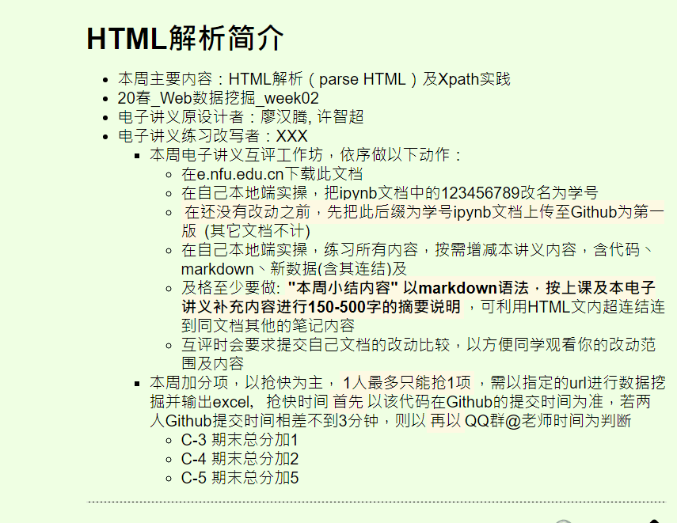

# web-dip-word

## week02 任务

### 本周小结内容
1. lxml + chrome
接下来需要选择器selector抽取数据img，借用HTML的"结构"性(chrome要从页面选到结构，你懂的)，有两种可能，必记下来

* xpath: $x('放這')

* CSS: $('放這')

**xpath**
/html/body/main/div/div[2]/a/img

/html/body/main/div/div[23]/a/img

**CSS**
body > main > div > div:nth-child(2) > a > img

body > main > div > div:nth-child(23) > a > img

2. 使用requests_html模块的HTMLSession

* r = session.get("")通过这行代码获取到要爬取数据的页面URL

* title = r.html.xpath('//*[@class="news_title"]//a/@title')

通过xpath抓取具体内容，必要了解xpath抓取路径：
|路径表达式|结果|
|---------|----|
|bookstore|选取 bookstore 元素的所有子节点。|
|/bookstore|选取根元素 bookstore。注释：假如路径起始于正斜杠( / )，则此路径始终代表到某元素的绝对路径！|
|bookstore/book|选取属于 bookstore 的子元素的所有 book 元素。|
|//book|选取所有 book 子元素，而不管它们在文档中的位置。|
|bookstore//book|选择属于 bookstore 元素的后代的所有 book 元素，而不管它们位于 bookstore 之下的什么位置。|
|//@lang|选取名为 lang 的所有属性。|

**提示：如果 XPath 的开头是一个斜线（/）代表这是绝对路径。如果开头是两个斜线（//）表示文件中所有符合模式的元素都会被选出来，即使是处于树中不同的层级也会被选出来。**

